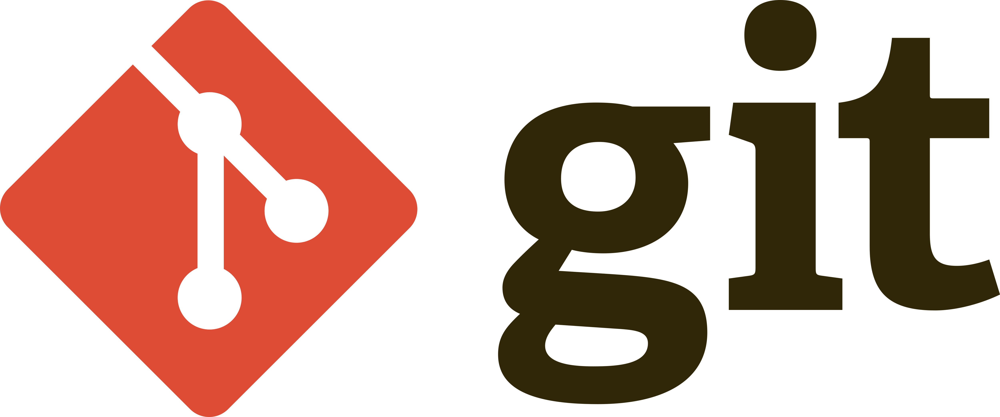
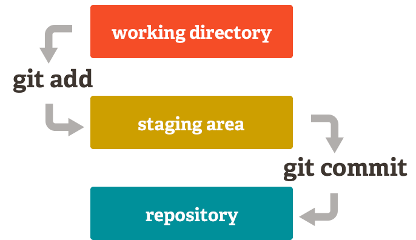

# GitScesi 2026

En este proyecto, aprenderé Git utilizando el repositorio como apuntes de clase.

    

 ## Autor
**Franco Prieto Ayala**

 <a href="https://github.com/Francopaa" target="_blank">***Francopaa***</a>

 ## Clase 1  
 
 ### Que es GIT?
 
 Es un **MVC**: Model Version Control 

#### ¿Qué es un sistema de control de versiones?

Es una herramienta que te ayuda a realizar un seguimiento de los cambios en los archivos a lo largo del tiempo. Te permite revertir a versiones anteriores, colaborar con otros y gestionar diferentes versiones de tu código.

### Como nacio GIT?
* **1990**: Surgieron las primeras herramientas de control de versiones como RCS y CVS.

* **2005**: <a href="https://en.wikipedia.org/wiki/Linus_Torvalds" target="_blank"> Linus Torvalds creó Git para el desarrollo del kernel de Linux.

* **2008**: Se lanzó GitHub, impulsando la adopción de Git. Inicialmente se creó con Ruby.

* **2018**: Microsoft adquirió GitHub, ampliando aún más su alcance.

* **2025**: GitHub lidera el mercado con funciones basadas en IA y herramientas de colaboración avanzadas.

### Como instalar GIT?

1. Ir a <a href="https://git-scm.com/install/" target="_blank"> **https://git-scm.com/install/**
2. Seguir los pasos de instalación recomendados para tu S.O. 
3. Verificar la correcta instalacion con **`git --version`**

### Configuracion basicas 

  <table>
    <tr>
      <th>Comando</th>
      <th>Descripción</th>
    </tr>
    <tr>
      <td><code>git config --global user.name "Tu Nombre"</code></td>
      <td>Configura GIT con tu nombre</td>
    </tr>
    <tr>
      <td><code>git config --global user.email "tu@correo.com"</code></td>
      <td>Configura GIT con tu correo</td>
    </tr>
    <tr>
      <td><code>git config --global core.autocrlf true/code></td>
      <td>anejar automáticamente los finales de línea en archivos de texto</td>
    </tr>
  </table>

## Clase 2

### STATES Y COMMITS
En Git, un estado se refiere al estado de tus archivos en el proceso de control de versiones.

* **Modified** : El archivo ha sido creado, modificado o eliminado, pero aún no se ha preparado para su confirmación.
* **Staged** : El archivo está marcado para ser incluido en la próxima confirmación.
* **Commited** : Los cambios se guardan en el repositorio local.

    

#### ¿Como hacer que el archivo que modifique vuelva a su estado original?

*`git restore <archivo>`**   borra físicamente el archivo modificado a su estado original

#### Git Add

Una vez que sepas qué archivos quieres incluir en tu commit, debes prepararlos usando el comando `git add`. Por ejemplo:

<table align="center">
  <tr>
    <th>Comando</th>
    <th>Descripción</th>
  </tr>
  <tr>
    <td><code>git add &lt;file&gt;</code></td>
    <td>Preparar un archivo específico</td>
  </tr>
  <tr>
    <td><code>git add .</code></td>
    <td>Preparar todos los archivos modificados</td>
  </tr>
</table>

**Tip :** Usa `git restore staged <file>` para quitar de stage.

#### Git Commit

Después de preparar los archivos, puedes crear una confirmación usando el comando `git commit`. Por ejemplo:

  <table>
    <tr>
      <th>Comando</th>
      <th>Descripción</th>
    </tr>
    <tr>
      <td><code>git commit</code></td>
      <td>Agrega el mensaje de confirmación en tu IDE.</td>
    </tr>
    <tr>
      <td><code>git commit -m "Your commit message"</code></td>
      <td>Agregar mensaje de confirmación directamente</td>
    </tr>
    <tr>
      <td><code>git commit --amend</code></td>
      <td>Modificar el último mensaje de confirmación o incluir nuevos cambios preparados.</td>
    </tr>
  </table>

Es importante tener en cuenta que estos cambios se guardarán en su repositorio local. A partir de ahora, para deshacerlos, deberá revertirlos creando una nueva confirmación en el historial de cambios del repositorio.

    

#### ¿Cómo puedo dejar de rastrear un archivo?

Crea un archivo `.gitignore` en tu proyecto y agrega los siguientes patrones para indicarle a Git qué archivos o carpetas debe ignorar:

<table align="center">
  <thead>
    <tr>
      <th>Descripción</th>
      <th>Patron en .gitignore</th>
    </tr>
  </thead>
  <tbody>
    <tr>
      <td>Ignorar todos los archivos <code>.log</code></td>
      <td><code>*.log</code></td>
    </tr>
    <tr>
      <td>Ignorar la carpeta <code>node_modules</code></td>
      <td><code>node_modules/</code></td>
    </tr>
    <tr>
      <td>Ignorar un archivo especifico</td>
      <td><code>secrets.env</code></td>
    </tr>
  </tbody>
</table>
#### Buenas practicas 
##### ¿Para qué sirven las buenas prácticas?
 
* Es un estándar seguido por la mayoría de los equipos de desarrollo.
* Resolver conflictos o problemas durante el desarrollo se vuelve más sencillo.
* El historial de commits es más legible.
##### ¿Con qué frecuencia hacer commits?
 
* Es mejor hacer commits pequeños, agrupando mejoras o acciones puntuales, que hacer un commit grande con todo lo que se quiere hacer.
* Hacer commits frecuentes no significa hacerlos sin propósito.
##### Cómo escribir buenos commits
 
* Usa verbos como: Add (Añadir), Change (Cambiar), Fix (Corregir) o Remove (Eliminar).
* No uses "." ni "..."; en el peor caso, usa ",".
* Usa un máximo de 50 caracteres para tu commit.
* Añade todo el contexto necesario.
* Usa prefijos para hacerlos más semánticos.
##### Prefijos para commits
 
* **feat**: para una nueva funcionalidad para el usuario.
* **fix**: para un bug que afecta al usuario.
* **perf**: para cambios que mejoran el rendimiento del sitio.
* **build**: para cambios en el sistema de construcción, despliegue o tareas de instalación.
* **ci**: para cambios en la integración continua.
* **docs**: para cambios en la documentación.
* **refactor**: para refactorización de código, como renombrar variables o funciones.
